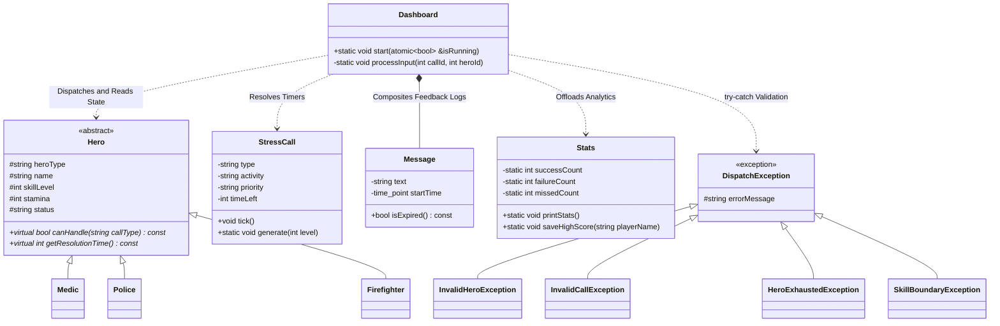

# 🚨 BACHAO: Stress Calls Dispatch Terminal 🚨


Welcome to **BACHAO** (Bengali for "Save"), a high-stakes, real-time resource management and dispatch simulation built entirely in the C++ terminal! 

## 👨‍💻 Developed By

This project was built by the following team members:
* **Saad Al Abeed** - 230041142
* **Ahnaf Irtiza Nibir** - 230041134
* **Anas Ibn Aziz** - 230041122
* **Adi Islam** - 230041138

The city is in chaos, emergencies are popping up everywhere, and the clock is ticking. You have exactly **120 seconds** to manage your roster of heroes, dispatch them to active crises, and keep the city from falling apart. Do you have what it takes to get an "Outstanding Leadership" rating?

---

## 🎮 The Mission (Gameplay)

Unlike normal turn-based terminal games, **BACHAO runs in real-time**. While you are deciding who to send, the emergency timers are constantly ticking down! 

The screen is divided into three live-updating sectors:
1. **⬅️ Live Emergency Dashboard:** A ticking list of active stress calls (crimes, disasters, medical emergencies) with countdown timers. If a timer hits zero, the call expires, and people get hurt!
2. **➡️ Hero Roster:** Your list of available first responders. You must monitor their Skills, Status (Available, On-Duty, Resting), and **Stamina**.
3. **⬇️ Dispatch Command:** The input terminal where you make the calls. 

### 🦸‍♂️ Meet Your Heroes
You command a specialized task force. Sending the wrong hero to an emergency will result in a dispatch failure!
* 🚑 **Medics (Dr. Emily, Dr. James, Dr. Lisa):** Exclusively handle **Medical** emergencies.
* 🚓 **Police (Officer John, Officer Sarah, Officer Mike):** Armed and ready to handle **Crime** and **Political** unrest.
* 🚒 **Firefighters (Chief Tom, Captain Alex, Lt. Rachel):** Heavy-duty responders for **Hazards** and **Disasters**.

---

## ✨ Core Features

* ⏱️ **Real-Time Multithreading:** The game utilizes `std::thread` and `std::mutex` to independently render emergencies, track hero stamina, and read player input simultaneously without freezing the screen.
* 🧠 **Polymorphic OOP Logic:** Built with strict C++ inheritance. Heroes possess unique resolution times based on their `skillLevel` and utilize virtual functions to validate dispatch requests.
* 🔋 **Stamina Management System:** Heroes aren't machines. Dispatching a hero drains their stamina. Push them too hard, and they will be forced into a long recovery rest, leaving you short-handed!
* 🎨 **ANSI Escape UI:** A fully custom terminal engine that teleports the cursor and paints the terminal with color-coded alerts (Red for critical timers, Green for available heroes). This eliminates screen flickering and gives an immersive custom console feel.
* 📊 **Dynamic Stress Call Engine:** Emergencies are dynamically generated via `<random>` libraries providing shifting priorities (Low to Critical) and randomized locations with accurate timeouts. 
* 📈 **Performance Statistics Tracking:** The `Stats` system persistently tracks successful dispatches, failures, and missed calls utilizing thread-safe operations to accurately grade your final leadership performance.

---

## 🚀 How to Play

### 1. Terminal Requirements
Because BACHAO uses a highly customized live UI, **your terminal window MUST be resized to at least 155 x 50 dimensions** or full-screen before running the game, otherwise the UI will break!

### 2. Dispatching Units
Look at the active calls on the left, and your available heroes on the right. 
In the command prompt at the bottom, type the `<Call ID>` followed by the `<Hero ID>` and press Enter.

**Example:**
To send Hero #4 (Dr. Emily) to Call #1 (A Medical Emergency), type:
```text
1 4
```

---

## 📋 Output Features & Analytics

Once your 120-second shift concludes, BACHAO provides robust output and persistence features:
* 📉 **Shift Breakdown Report:** Immediately provides your dispatch success rate alongside explicit counts of generated, resolved, missed, and inherently failed stress calls. 
* 🏆 **Highscore Tracking:** Prompts the player for their name and persistently stores high scores using custom File I/O (`highscore.txt`). The leaderboard ranks operators globally across multiple sessions!
* 📜 **Player Records:** Safely appends and updates persistent individual player attempt histories inside `records.txt`.
* 🔔 **Live Dispatch Notifications:** Features a transient `Message` UI feed that explicitly details the result of a dispatch in real-time right below the input bar before dissolving gracefully.

---

## 📐 Codebase Structure (UML)

To visualize the overarching C++ structures, below is a standard Markdown Mermaid Class Diagram modeling the core relationships driving BACHAO:



---

## 🏗️ Object-Oriented Programming (OOP) Concepts Utilized

BACHAO is engineered using a robust Object-Oriented C++ architecture. Here are the core concepts implemented throughout the codebase:

### 1. Encapsulation & Abstraction
* **Classes & Access Modifiers:** Foundational models like `StressCall`, `Hero`, `Stats`, and `Dashboard` use `private`, `protected`, and `public` specifiers to hide internal state (like a hero's true `stamina` or exact `status`) and expose only strictly validated getter and setter wrappers.
* **Composition:** The `Message` class is safely encapsulated *inside* the private scope of the `Dashboard` class. The `Dashboard` creates and strictly dictates the memory lifetime of its feedback alerts in real-time, demonstrating strong OOP Composition.

### 2. Inheritance
* **Hierarchical Classification:** `Medic`, `Police`, and `Firefighter` publicly inherit from the base `Hero` class, inheriting members like `name`, `stamina`, and `status`, while keeping specific implementations separated.
* **Custom Exceptions:** Extensive OOP error handling is achieved via a dedicated `DispatchException` hierarchy (e.g. `InvalidHeroException`, `HeroExhaustedException`, `SkillBoundaryException`) that inherently derives directly from the standard C++ `std::exception`.

### 3. Polymorphism & Virtual Functions
* **Pure Virtual Methods:** The `Hero` base class enforces a uniform behavior contract through pure virtual functions like `virtual bool canHandle(const string& callType) const = 0` and `virtual int getResolutionTime() const = 0`.
* **Dynamic Binding:** A unified `vector<Hero*> heroList` takes advantage of runtime polymorphism. The main dispatch loop seamlessly calls `hero->canHandle()` universally, and the C++ engine dynamically routes the query to the correct derived `Medic`, `Police`, or `Firefighter` method depending on the underlying instantiated object type.

### 4. Constructors and Destructors
* **Parameterized Constructors:** Objects are explicitly initialized via parameterized constructors utilizing member initializer lists (e.g. `Hero(...) : heroType(heroType), name("")...`). 
* **Virtual Destructors:** The `Hero` class provides a `virtual ~Hero() = default;` destructor ensuring that whenever polymorphic base pointers are deleted, the application properly cascades the memory destruction algorithms to the specific child objects without memory leaks.

### 5. File Handling & Persistence
* The `Stats` static class seamlessly utilizes `std::ifstream` and `std::ofstream` specifically inside `Stats::saveHighScore()` and `Stats::printLeaderboard()`. This system persistently reads, truncates, overwrites, and intelligently organizes the Highscore logs alongside custom player histories (`records.txt`) across multiple independent application processes.

### 6. Robust Error Handling (try-catch)
* The entire command dispatch structure within `Dashboard::processInput()` prevents terminal halting using a massive `try-catch` wrapper block. Illegal moves (like deploying exhausted responders) directly `throw` targeted `DispatchException` objects, which are safely caught and translated into visible red UI error logs dynamically rendering the payload of the overridden `.what()` method.

### 7. Constants, Statics, & Thread-Safety
* **Constant keyword (`const`):** Emphasized aggressively in class getters (e.g. `string getHeroType() const`) to strongly guarantee state-safety inside loops, alongside `const std::vector` static databases containing all procedural generation locations.
* **Static Storage & Mutex Locks:** Sandbox singletons utilizing `static` variables across `Stats` tracking arrays (`successCount`) alongside localized `std::mutex` locking procedures wrapping all critical assignments to circumvent race conditions inherent in multi-threaded interactions.

### 8. Operator Overloading
* The `Hero` class provides custom mathematical mutations for the unary `operator++` and `operator--`. This allows the application to cleanly increment or decrement a hero's dynamic `skillLevel` array utilizing intuitive expressions like `++(*hero);` instead of traditional mutator functions, naturally enforcing skill-bounds internally.
